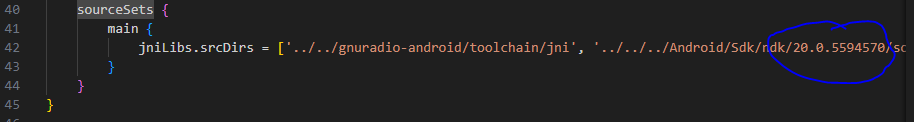
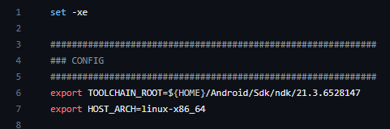

# GNU Radio Android AM Transmitter
Work done thus far on attempting to transmit an audio wav file from android using sdr.
This app is adapted from [FM Receiver](https://github.com/bastibl/android-fm).

There is an apk file for internal audio file transfer in the folder named AM_Virtual together with the native.cpp for it.

## Installation

Building the app requires the [GNU Radio Android toolchain](https://github.com/bastibl/gnuradio-android/). Please see this repository for further instructions on how to build the toolchain.

I have also included the docker file here in the docker folder together with some additional build scripts.

### Things to note when running toolchain
* App in Android Studio uses NDK v20.0.5594570 by default while GNU Radio Android toolchain builds NDK v21.3.6528147 by default. 
* To change NDK version of App, modify the version number in app/build.gradle under sourceSets

* To change NDK version of toolchain container, download the required NDK version from Android studio, change the version number in the export toolchain root line in the [build.sh](https://github.com/bastibl/gnuradio-android/blob/main/build.sh)/[build_aarch64.sh](https://github.com/bastibl/gnuradio-android/blob/main/build_aarch64.sh) file 

## Running the App

The USB vender/product IDs and the device type are hardcoded. Please adapt `native_lib.cpp` and `MainActivity.kt` accordingly.
  The path to .wav file is hardcoded in `native_lib.cpp`.  Audio .wav files used has to be in a folder under wavfiles and named as input.wav
  Flowgraph is in C++ domain of the app under app/src/main/cpp. Please refer to the link in references for more information.

## References
[GNU Radio Wiki](https://wiki.gnuradio.org/index.php/Android)
